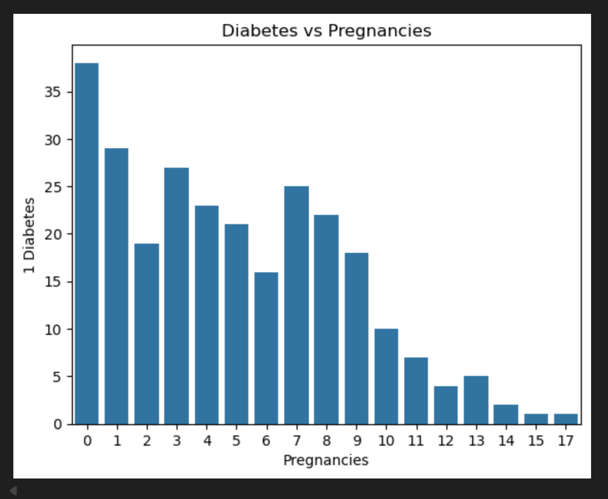
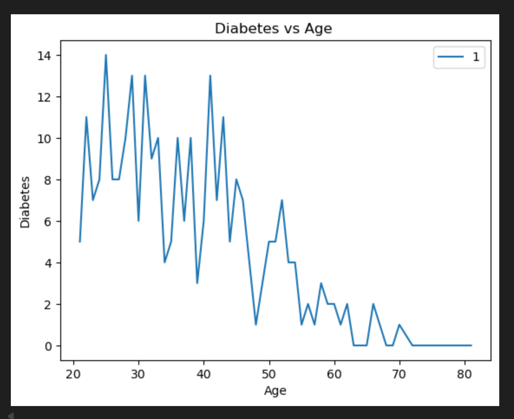
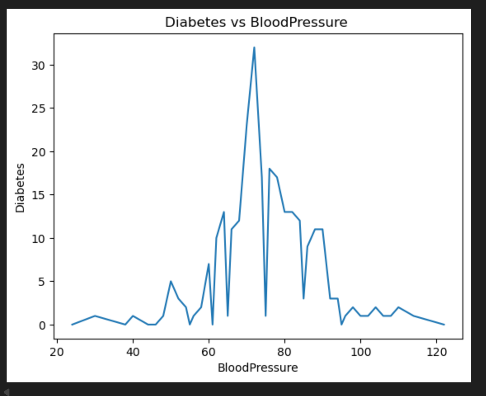
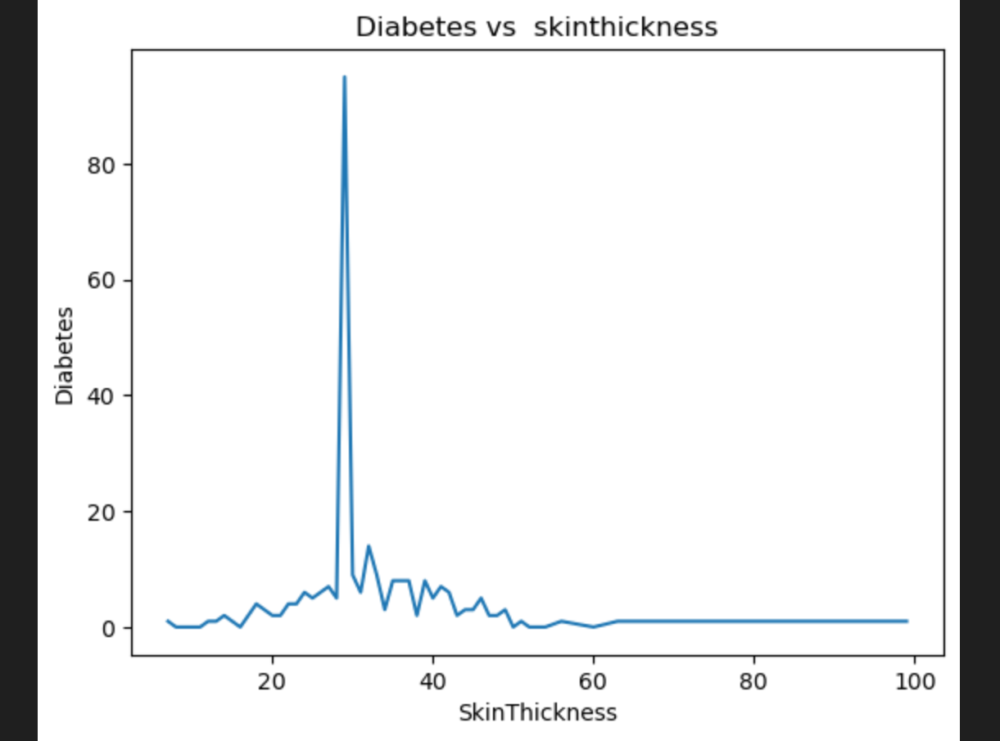
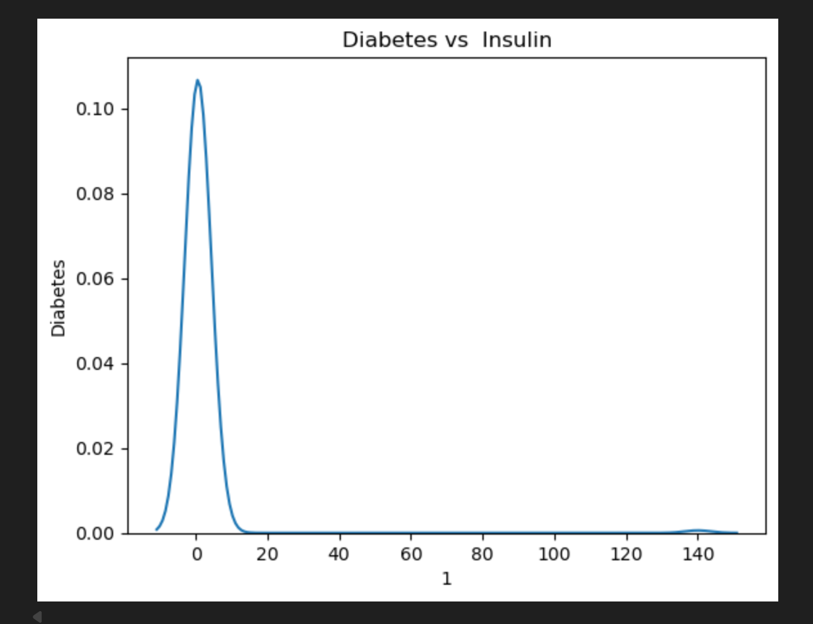
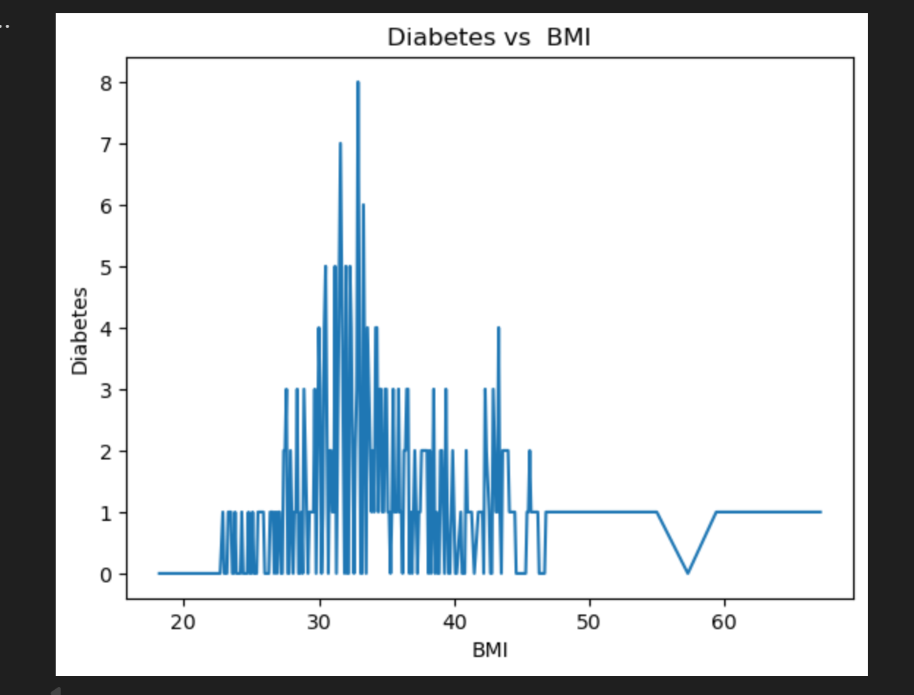
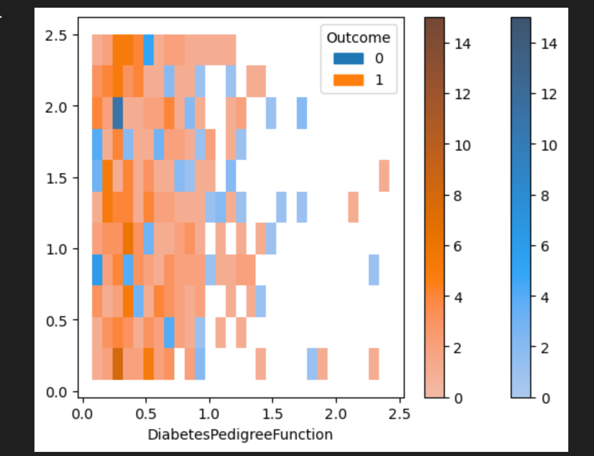

# 🩸 Diabetes Prediction System — End-to-End Machine Learning Project

### 🔗 Live Deployments  
- **Flask REST API:** [https://diabetes-api-app-rf.onrender.com/](https://diabetes-api-app-rf.onrender.com/)  
- **Streamlit Web App:** [https://sudhakarreddy2005-diabetes-api-app-mgmtty.streamlit.app/](https://sudhakarreddy2005-diabetes-api-app-mgmtty.streamlit.app/)

---

## 📘 Overview

This project predicts the likelihood of diabetes using a patient's medical and physiological data.  
It demonstrates a **complete Machine Learning lifecycle** — from data analysis and model training to deployment using **Flask** and **Streamlit**.

**Key Highlights:**
- Comprehensive **data visualisation and feature insights**  
- Comparative **machine learning model evaluation**  
- REST API built with **Flask**  
- User-friendly web app built with **Streamlit**  
- Fully deployed on **Render** and **Streamlit Cloud**

---

## 📊 Dataset Information

The model uses the **PIMA Indians Diabetes Dataset** (UCI / Kaggle).

| Feature | Description |
|----------|-------------|
| Pregnancies | Number of times pregnant |
| Glucose | Plasma glucose concentration |
| BloodPressure | Diastolic blood pressure (mm Hg) |
| SkinThickness | Triceps skinfold thickness (mm) |
| Insulin | 2-hour serum insulin (mu U/ml) |
| BMI | Body Mass Index (weight in kg / height in m²) |
| DiabetesPedigreeFunction | Diabetes risk score based on family history |
| Age | Patient's age (years) |
| Outcome | 1 = Diabetic, 0 = Non-diabetic |

---

## 📈 Exploratory Data Analysis (EDA)

Performed in `diabetes_notebook.ipynb`, this section focuses on feature-level trends and correlations.

---

### 1️⃣ Pregnancies vs Diabetes


> 💬 **Insight:**  
> Pregnancies count **0, 1, 3, 4, and 8** show the **highest diabetes occurrence**.  
> Both low and moderate pregnancy counts can lead to metabolic strain, increasing risk.

---

### 2️⃣ Age vs Diabetes


> 💬 **Insight:**  
> Clearly, **ages 20–30**, **30–35**, and **40–45** have the **highest diabetes rates**.  
> The risk rises steadily with age as insulin sensitivity decreases.

---

### 3️⃣ Blood Pressure vs Diabetes


> 💬 **Insight:**  
> **Blood Pressure (65–75 mmHg)** and **(75–85 mmHg)** groups have **more diabetic patients**.  
> Moderate BP ranges may reflect glucose metabolism imbalances.

---

### 4️⃣ Skin Thickness vs Diabetes


> 💬 **Insight:**  
> **Skin thickness ≈ 30 mm** corresponds to **more diabetic cases**,  
> possibly linked to subcutaneous fat accumulation and insulin resistance.

---

### 5️⃣ Insulin vs Diabetes


> 💬 **Insight:**  
> Patients with **Insulin (0–20 µU/ml)** show **higher diabetes incidence**.  
> This range may indicate insufficient insulin secretion.

---

### 6️⃣ BMI vs Diabetes


> 💬 **Insight:**  
> **BMI (30–35)** range shows **most diabetic patients**.  
> Obesity and excess body fat directly increase diabetes likelihood.

---

### 7️⃣ Diabetes Pedigree Function (DPF)


> 💬 **Insight:**  
> Clearly, **DPF (0.0–0.8)** group has **higher diabetes occurrence**.  
> Even moderate genetic risk can lead to diabetes under poor lifestyle habits.


## 🤖 Machine Learning Model Comparison

Multiple models were tested and optimised to find the best-performing one.

| Model | Type | Accuracy | F1-Score | Comment |
|--------|------|-----------|-----------|----------|
| Logistic Regression | Baseline linear model | 0.82 | 0.63 | Solid baseline |
| **Optimised Logistic Regression** | GridSearchCV tuned | 0.80 | 0.59 | Slightly lower F1-score |
| Random Forest Classifier | Ensemble model | 0.82 | 0.60 | Balanced accuracy |
| **Optimised Random Forest** | GridSearchCV tuned | **0.82** | **0.63** | ✅ Best overall |

> 💬 **Insights:**  
> - Optimised Logistic Regression performed slightly worse than normal Logistic Regression (F1: 0.59 vs 0.63).  
> - Optimised Random Forest improved F1-score from 0.60 → **0.63**, showing stronger recall.  
> - **Optimised RF > Optimised LR**, reflecting better generalisation and robustness.

---

## 🏆 **Conclusion**

> ✅ **Optimised Random Forest** is the **best-performing model**,  
> achieving **Accuracy = 0.82** and **F1 = 0.63**, outperforming both standard and optimised Logistic Regression models.  
> It provides the most accurate and realistic predictions for diabetes classification.

---

## ⚙️ Flask REST API — `api.py`

The trained model is deployed as a **Flask REST API** for real-time predictions, hosted on **Render**.

### Endpoints
| Route | Method | Description |
|--------|---------|-------------|
| `/` | GET | API live status |
| `/predict` | POST | Takes JSON input and returns prediction |

### Example Request
```bash
POST https://diabetes-api-app-rf.onrender.com/predict
Content-Type: application/json

{
  "Pregnancies": 2,
  "Glucose": 130,
  "BloodPressure": 70,
  "SkinThickness": 25,
  "Insulin": 80,
  "BMI": 28.5,
  "DiabetesPedigreeFunction": 0.5,
  "Age": 32
}

# Clone repository
git clone https://github.com/sudhakarreddy2005/diabetes-api.git
cd diabetes-api

# Create virtual environment
python -m venv venv
source venv/bin/activate      # (Windows: venv\Scripts\activate)

# Install dependencies
pip install -r requirements.txt

# Run Flask API
python api.py
# Open: http://127.0.0.1:5000/

# Run Streamlit app
streamlit run app.py

